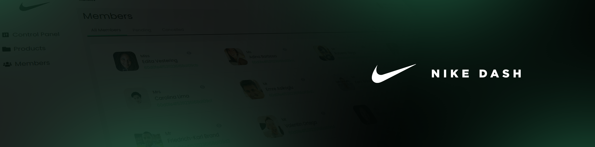

<p align="center">

<div id="topo"></div>
<h1 align="center"><strong>Nike Dash</strong></h1>
<p align="justify">
<b> Importante: </b>Este projeto é completamente fictício e não possui nenhuma afiliação, associação ou ligação com a marca Nike. O uso do nome "Nike" é estritamente para fins ilustrativos.
</p>
<div align="center">
<a href="https://github.com/vitorRibeiro7/nikeDash-viptech" target="_blank">

</a>
<a href="https://github.com/vitorRibeiro7/nikeDash-viptech" target="_blank">

</a>
<a href="https://github.com/vitorRibeiro7/nikeDash-viptech" target="_blank">

</a>
</div>

<h3 align="justify"></h3>

<div align="center">
[ <a href="https://nikedash.netlify.app" target="_blank">Acesse a aplicação aqui </a> ]
</div>

<h3 align="justify"></h3>

---



---


<div id="#sobre" align="center">

<h2 align="center"> <strong> Sobre o projeto </strong> </h2>

<p align="left">
A aplicação utiliza React com Typescript e Tailwind CSS para criar uma interface frontend que se integra à API DummyAPI. O layout, prototipado inicialmente, é flexível e responsivo, permitindo uma experiência consistente em dispositivos variados. A listagem de pessoas exibe informações essenciais, como ID, nome completo e foto do perfil, com a capacidade de clicar em cada item para revelar detalhes adicionais, incluindo email, data de nascimento e gênero. A implementação inclui funcionalidades avançadas, como paginação para navegação fácil, busca por ID e uma arquitetura limpa, utilizando Typescript para garantir tipagem forte e melhor manutenção do código. O uso de Tailwind agrega uma estilização eficiente e modular à aplicação. Esses elementos combinados proporcionam uma experiência robusta e técnica no desenvolvimento frontend.
<br>
</p>

</div>

---

<h2 align="center"> <strong> Tecnologias utilizadas </strong> </h2>

- [Typescript](https://www.typescriptlang.org)
- [React](https://pt-br.reactjs.org)
- [Tailwind](https://tailwindcss.com)
- [Axios](https://axios-http.com/ptbr/)

> Veja o arquivo  [package.json](https://github.com/vitorRibeiro7/nikeDash-viptech/blob/main/package.json) para mais detalhes.


---
<h2 align="center"> <strong> Como rodar o projeto </strong> </h2>

```bash
    # Clone este repositório
    $ git clone https://github.com/vitorRibeiro7/nikeDash-viptech.git

    # Acesse a pasta do projeto
    $ cd nikeDash-viptech

    # Instale as dependências
    $ npm install

    # Inicie o servidor
    $ npm run dev
```
---

>  [Prototipo](https://www.figma.com/file/Pe4B1tEuNe9uTi1a6iriEu/NIKE-DASH?type=design&node-id=0%3A1&mode=design&t=G9yYhE4pi6l14PDs-1)

---

<br>


<p align="center">[ <a href="#topo">Voltar para o topo</a> ]</p>